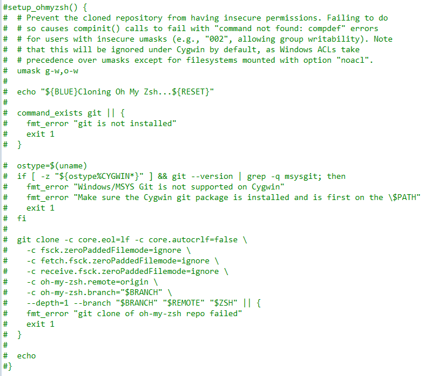
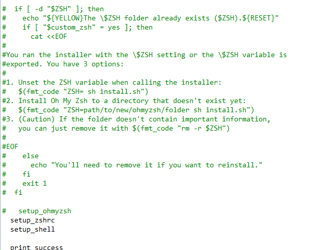

# 软件安装 

## Windows 软件安装

### Zoreto软件安装与Onedrive网盘同步

主要是通过软链接的方式，Windows下命令'mklink /J'进行创建软链接，'rmdir'进行删除*(不要用'del')*
```cmd
mklink /J "<数据存储位置>/storage" "<同步盘中的storage位置>"
```

### Qt集成开发工具

从Qt5.15开始，官方已经不提供离线安装包。因此需要从[官网](https://www.qt.io/download)或者从[清华大学开源软件镜像站](https://mirrors.tuna.tsinghua.edu.cn/qt/official_releases/online_installers/)下载在线安装文件。

* 先登录自己的账号。
* 勾选最新的Qt组件。
* 等待安装。安装完成之后记得试一下环境是否可用。

## Linux 软件安装

### zsh工具

* 先安装zsh（Ubuntu为例）

  ```bash
  sudo apt-get install zsh
  ```

* 安装*oh-my-zsh* 

  * curl安装

    ```bash
    sh -c "$(curl -fsSL https://raw.github.com/robbyrussell/oh-my-zsh/master/tools/install.sh)"
    ```

  * wget安装

    ```bash
    sh -c "$(wget https://raw.github.com/robbyrussell/oh-my-zsh/master/tools/install.sh -O -)"
    ```

  * 如果服务器网络不佳，或者不能访问GitHub，则

    * 需要先从[镜像网站]([Gitee 极速下载/oh-my-zsh](https://gitee.com/mirrors/oh-my-zsh))下载zip文件。

    * 解压到用户目录'$HOME'下，并重命名为'.oh-my-zsh'。

    * 删除setup_ohmyzsh函数、调用和'folder  already exist'字符串附近的if语句。

    
    
    


    * 执行安装脚本 

    ```bash
    ~/.oh-my-zsh/tools/install.sh
    ```


# Manjaro 相关问题

## VMware中安装Manjaro分辨率不能自适应:

``` bash
systemctl restart vmtoolsd.service
```

## 更换清华源

```bash
sudo vi /etc/pacman.conf
```

修改源，最后加入

```bash
[archlinuxcn]
Server = https://mirrors.tuna.tsinghua.edu.cn/archlinuxcn/$arch
```

安装archlinuxcn-keyring包导入GPG key

```bash
sudo pacman -Sy archlinuxcn-keyring
```

## 中文输入法

1. 安装fcitx5软件包

   ```bash
   sudo pacman -S fcitx5 fcitx5-configtool fcitx5-qt fcitx5-gtk fcitx5-chinese-addons fcitx5-material-color
   ```

   * fcitx5: 输入法基础框架主程序

   * fcitx5-configtool(kcm-fcitx5)：输入法配置程序(KDE桌面环境的支持)

   * fcitx5-qt: QT5程序的支持 

   * fcitx5-gtk: GTK程序的支持 

   * fcitx5-chinese-addons: 简体中文输入的支持，云拼音

   * fcitx5-material-color：一款使用 Material Design 配色的 fcitx5 皮肤，旨在模仿 Windows 10 自带输入法的 UI

2. 修改环境变量 '~/.pam_environment'

   ```bash
   GTK_IM_MODULE DEFAULT=fcitx
   QT_IM_MODULE  DEFAULT=fcitx
   XMODIFIERS    DEFAULT=@im=fcitx
   ```

3. [配置主题](https://github.com/hosxy/Fcitx5-Material-Color)

   一款使用 Material Design 配色的 fcitx5 皮肤，旨在模仿 Windows 10 自带输入法的 UI。

   然后修改配置文件 `~/.config/fcitx5/conf/classicui.conf`：

   ```bash
   # 垂直候选列表
   Vertical Candidate List=False
   
   # 按屏幕 DPI 使用
   PerScreenDPI=True
   
   # Font (设置成你喜欢的字体)
   Font="思源黑体 CN Medium 13"
   
   # 主题
   Theme=Material-Color-Pink
   ```

​			根据颜色不同，使用以下主题名称：

- Material-Color-Pink
- Material-Color-Blue
- Material-Color-Brown
- Material-Color-DeepPurple
- Material-Color-Indigo
- Material-Color-Red
- Material-Color-Teal
- Material-Color-Black
- Material-Color-Orange
- Material-Color-SakuraPink

### 手动安装

```
mkdir -p ~/.local/share/fcitx5/themes/Material-Color
git clone https://github.com/hosxy/Fcitx5-Material-Color.git ~/.local/share/fcitx5/themes/Material-Color
```

**手动设置配色方案**

手动设置/切换配色方案需要使用命令行，比如将配色方案设置/切换为 blue：

```
cd ~/.local/share/fcitx5/themes/Material-Color
ln -sf ./theme-blue.conf theme.conf
```

- **Tips 1**：第一次使用时必须设置一种配色方案（否则会打回原形）
- **Tips 2**：设置/切换配色方案后需要重启输入法以生效

**启用主题**

修改配置文件 `~/.config/fcitx5/conf/classicui.conf`：

```
# 垂直候选列表
Vertical Candidate List=False

# 按屏幕 DPI 使用
PerScreenDPI=True

# Font (设置成你喜欢的字体)
Font="思源黑体 CN Medium 13"

# 主题
Theme=Material-Color
```

**更新**

想要更新这个皮肤很简单，打开一个终端，执行以下命令：

```
cd ~/.local/share/fcitx5/themes/Material-Color
git pull
```

**单行模式 (inline preedit)**

要使用单行模式，

- 对于 fcitx5 自带的 pinyin，请修改 `~/.config/fcitx5/conf/pinyin.conf`
- 对于 fcitx5-rime，请新建/修改 `~/.config/fcitx5/conf/rime.conf`

加入/修改以下内容：

```
# 可用时在应用程序中显示预编辑文本
PreeditInApplication=True
```

**注意**：修改配置文件 `~/.config/fcitx5/profile` 时，请务必退出 fcitx5 输入法，否则会因为输入法退出时会覆盖配置文件导致之前的修改被覆盖；修改其他配置文件可以不用退出 fcitx5 输入法，重启生效。

### 备注

1. 使用 xim 的程序（非 GTK 非 Qt 程序）中无法使用单行模式，如 xterm, alacritty…
2. 较新版本 fcitx5 默认禁用了 gvim 的单行模式，若需启用，只需将环境变量 `FCITX_NO_PREEDIT_APPS` 设置为空即可。


## VIM 配置

### 安装vimplus

```bash
git clone https://github.com/chxuan/vimplus.git ~/.vimplus
cd ~/.vimplus
./install.sh //不加sudo
```

#### 更新vimplus

紧跟vimplus的步伐，尝鲜新特性

```
./update.sh
```


## GitHub Hosts

这个有什么用？最直观的效果是`GitHub`图片可以正常加载，网页也稳定了。

`GitHub Hosts`主要是通过修改`host`的方式加速`GitHub`访问，解决图片无法加载以及访问速度慢的问题。

- 主站: https://github.com/ineo6/hosts
- 镜像地址: https://gitee.com/ineo6/hosts


## 安装VScode

```bash
yay -S visual-stuio-code-bin
```

可能会遇见'Cannot find the fakeroot binary'这个是一个打包基本工具解压用的。可以在**base-devel**里面找到。

```bash
sudo pacman -Sy base-devel
```

### Operator Mono字体

* 先安装[FiraCode字体](https://github.com/tonsky/FiraCode/wiki/VS-Code-Instructions)

  ``` bash
  sudo pacman -S ttf-fira
  ```

* 再安装operator mono字体（GitHub上面找一下）例如：

  ```bash
  git clone https://github.com/beichensky/Font.git
  ```
  或者用[DownGit](https://minhaskamal.github.io/DownGit/#/home)下载这个[iampika GitHub](https://github.com/iampika/dotfiles/tree/master/fonts)文件。

* 将字体otf或者ttf文件复制到'/usr/share/fonts/OperatorMono'文件夹下（OperatorMono为新建的一个子文件夹），

* 刷新一下

  ```bash
  sudo fc-cache -fv
  ```

* VScode配置参考[Winter is Coming Theme](https://marketplace.visualstudio.com/items?itemName=johnpapa.winteriscoming)

  **记得**设置连笔为**True**

  ```json
  {
      "editor.fontLigatures": true,
  }
  ```


## Onedrive

```bash
$ yay -S onedrive
```

**Setup**

The GitHub page doesn’t explicitly cover executing the application for the first time. The application after the installation was installed in /usr/local/bin as onedrive. This should be on your path so we just need to run the application.

````bash
$ onedrive
Authorize this app visiting:

A really big URL.

Enter the response uri:
````

What this is doing is providing you a URL that you paste into your browser that will prompt a login into OneDrive and then ask for you to grant permission for the OneDrive Free client to access your OneDrive. You will be redirected if you give it the permission to a blank page. You will need to copy that URL and paste it back into terminal as the response URI.

Once that is finished you now have the OneDrive Free client functioning with your OneDrive. This will create a OneDrive directory in your home directory that will be used to sync your files. 


